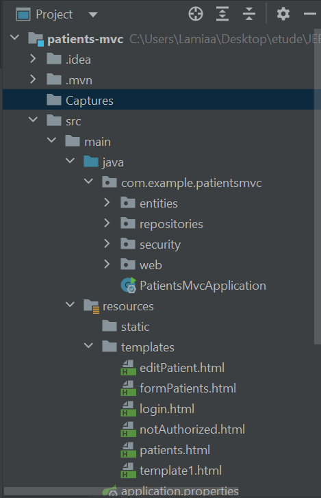
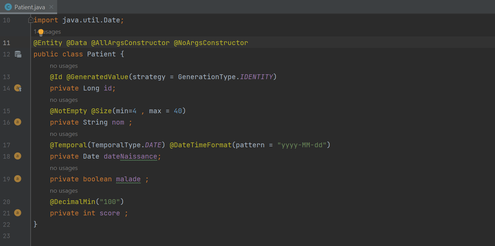
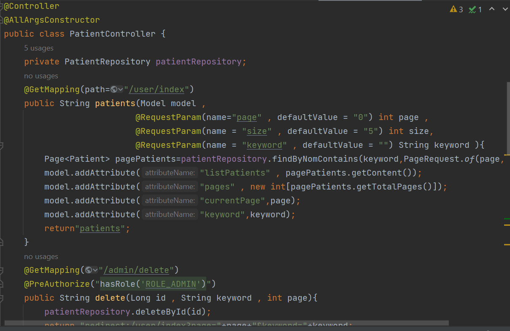
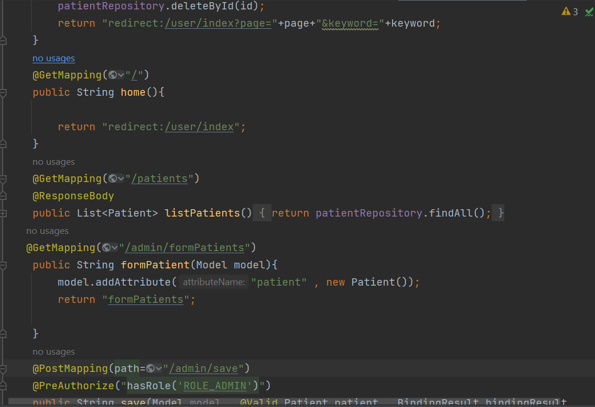
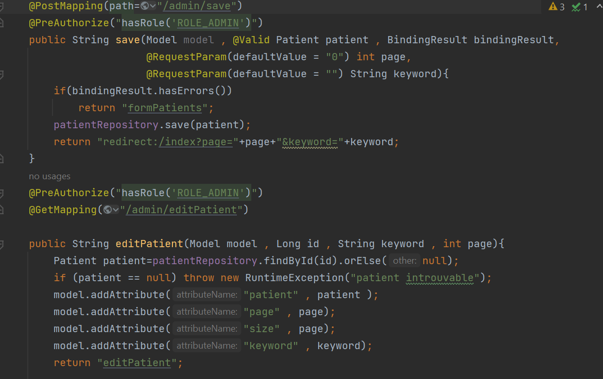
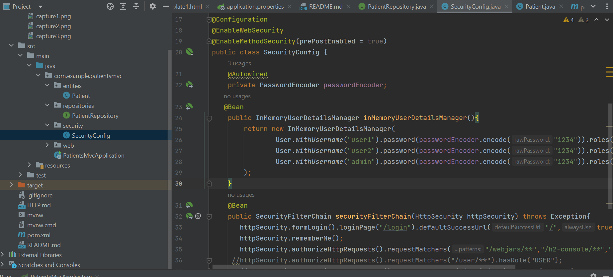
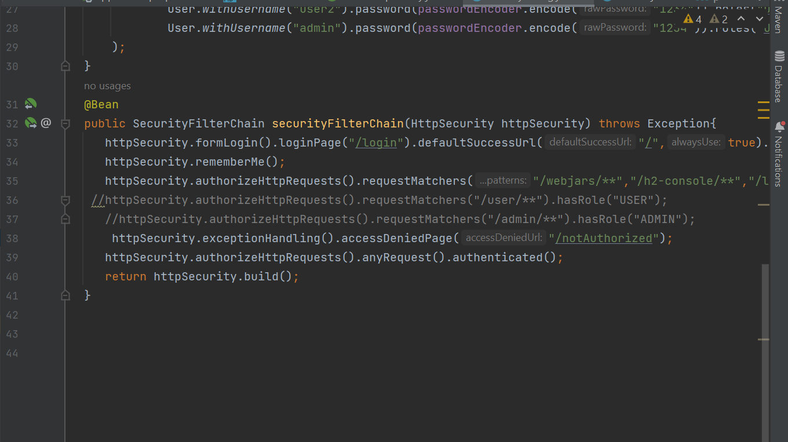

<h1>Spring MVC avec Thymeleaf & Spring Security </h1>
<h4>Une application Web JEE basée sur Spring MVC, Thylemeaf et Spring Data JPA qui permet de gérer les patients.
</h4>

<ul>
<h3> Les tâches : </h3>
<li> Afficher les patients </li>
<li> Faire la pagination</li>
<li> Chercher les patients</li>
<li> Supprimer un patient</li>
</ul>

<h4>2. Création de l'entité JPA Patient ayant les attributs :</h4>
<ul>
<li> id de type Long</li>
<li> nom de type String</li>
<li> dateNaissance de type Date</li>
<li> malade de type boolean</li>
<li> score de type int</li></ul>

<h4> Entity : Patient</h4>

<h4>PatientController.java</h4>

<h4>SecurityConfig.java</h4>

<h4> La page Home ( Utilisateur normal )  </h4>

<h4> La page Home ( Admin ) </h4>

